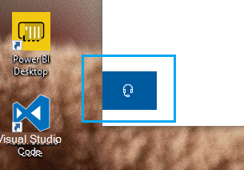

# 헤드폰 단추를 클릭 하 여 문의

Microsoft 지원에 문의 하려면이 앱의 왼쪽 아래 모서리에 **있는 문의처를 클릭 하세요** . 플라이 아웃 창 안에 제품 및 이슈 범주를 선택한 후 적절 한 채널을 기반으로 합니다.

문의처 세션을 시작한 후에도 나머지 앱과 계속 상호 작용할 수 있습니다. 앱 내부의 아무 곳 이나 클릭 하 여 연락처의 사용자를 일시적으로 최소화할 수 있습니다. 같은 세션으로 **돌아가려면 다시 문의처** 를 클릭 하면 됩니다.
